# Percepción para navegación con ROS 2: `percepcion_nav`

Actividad integradora del Tema 5 (MPIAF-12 Visión Inteligente). Autor: José Ángel Balbuena.

`percepcion_nav` es un paquete de **ROS 2 Jazzy** que reparte en nodos desacoplados un pipeline
de percepción para navegación: una **cámara**, un **detector YOLO** que publica `vision_msgs`, una
**verificación visual**, un componente **RGB-D** que ubica el objeto en 3D y un **cliente de
acción** que manda al robot hacia el objeto con **Nav2**. Solo usa mensajes estándar.

| Pipeline 2D: cámara → detector → visualización | Simulación: el TurtleBot 4 detecta la silla y navega hasta ella |
|---|---|
| 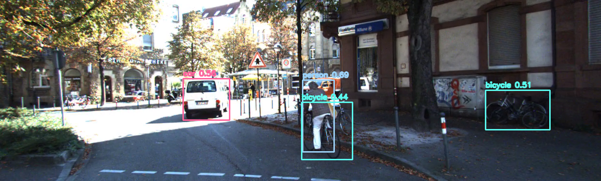 | 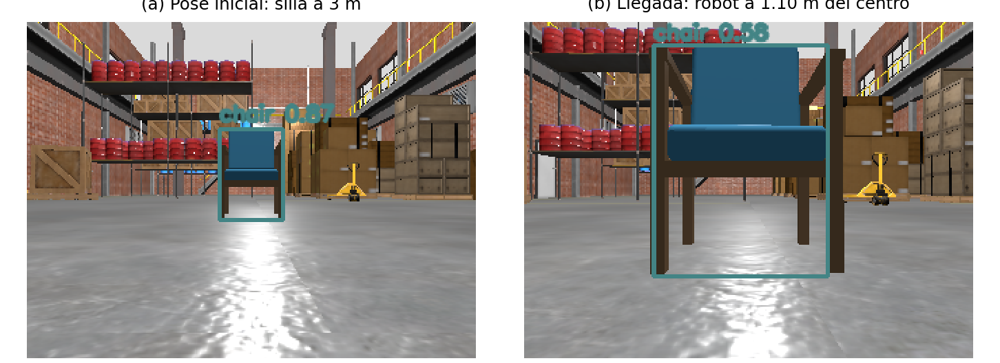 |

**Resultado principal**: en 5 corridas independientes en Gazebo con Nav2 real, el robot estimó la
silla a **0.04 m** de su centro real y se detuvo a entre **1.03 y 1.10 m** de ella, mirándola,
con resultado `SUCCEEDED` las **5 veces** ([detalle](#resultados)).

## Contenido

1. [Qué hace cada nodo](#qué-hace-cada-nodo)
2. [Arquitectura y diagramas](#arquitectura-y-diagramas)
3. [Componente RGB-D](#componente-rgb-d)
4. [Conexión con Nav2](#conexión-con-nav2)
5. [Decisiones de diseño](#decisiones-de-diseño)
6. [Requisitos](#requisitos)
7. [Instalación](#instalación)
8. [Compilación y pruebas](#compilación-y-pruebas)
9. [Ejecución](#ejecución)
10. [Verificación](#verificación)
11. [Resultados](#resultados)
12. [Validado frente a diseño](#validado-frente-a-diseño)
13. [Problemas conocidos](#problemas-conocidos)
14. [Limitaciones](#limitaciones)
15. [Estructura del repositorio](#estructura-del-repositorio)
16. [Documentación adicional y créditos](#documentación-adicional-y-créditos)

---

## Qué hace cada nodo

| Ejecutable | Nodo | Entrada | Salida | Responsabilidad |
|---|---|---|---|---|
| `camera_node` | `camera` | Video o dispositivo | `/camera/image_raw` (`sensor_msgs/Image`) | Publica cada cuadro con `cv_bridge`, estampa de tiempo y `frame_id` óptico. Si la fuente no existe o se pierde, registra el error y reintenta cada 2 s sin caerse |
| `detector_node` | `detector` | `/camera/image_raw` | `/detections` (`vision_msgs/Detection2DArray`) | YOLO11n (COCO) en CPU. Cada detección lleva bbox en píxeles, clase y score; el `header` es el de la imagen |
| `visualizer_node` | `visualizer` | Imagen + `/detections` | `/detections_image` (`sensor_msgs/Image`) | Empareja por estampa exacta y dibuja rectángulo, clase y score |
| `rgbd_localizer_node` | `rgbd_localizer` | `/detections` + profundidad + `CameraInfo` | `/detections_3d` (`vision_msgs/Detection3DArray`) | Posición 3D del objeto en el marco óptico (mediana de profundidad + modelo pinhole) |
| `nav2_goal_sender_node` | `nav2_goal_sender` | `/detections_3d` + `/tf` | `/goal_pose_preview` (`geometry_msgs/PoseStamped`) y acción `NavigateToPose` | Lleva el objeto a `map` con tf2, calcula una meta a 1 m mirándolo y la envía a Nav2 (o solo la publica en `dry_run`) |
| `synthetic_depth_node` | `synthetic_depth` | `/camera/image_raw` | Profundidad constante + `CameraInfo` | Herramienta de prueba: permite correr toda la cadena en `dry_run` sin cámara RGB-D |
| `sim_panel` | — | — | — | Panel con botones para iniciar, navegar y detener la simulación durante la demostración |

---

## Arquitectura y diagramas

### Diagrama de nodos y tópicos

Línea continua: tópico. Línea punteada: acción (solo con `dry_run:=false`). Este diagrama
coincide con `rqt_graph` del sistema en ejecución (captura más abajo).

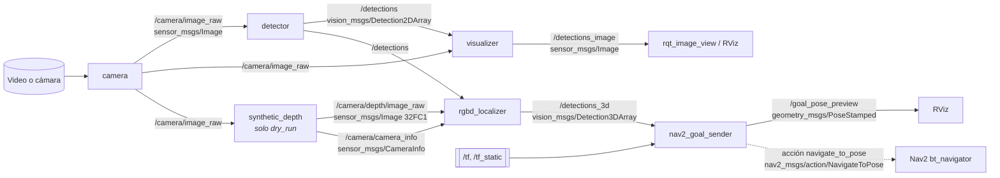

### Grafo del sistema en ejecución

Grafo del lanzamiento `dry_run`, obtenido del sistema en ejecución. Para compararlo en vivo:
`ros2 run rqt_graph rqt_graph`.

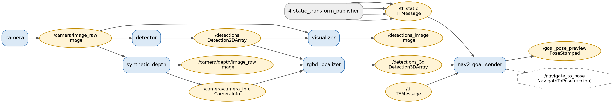

### Flujo de un cuadro y estampas de tiempo

Todo dato derivado de una imagen conserva su `header` (estampa `t` y marco). Eso permite
emparejar flujos por estampa y consultar tf2 en el instante en que se tomó la imagen.

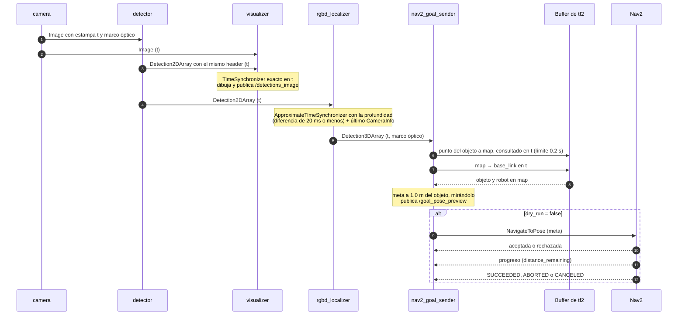

### Qué se lanza en cada modo

| Nodo | `pipeline_2d` | `dry_run` | `simulation` |
|---|---|---|---|
| `camera` | sí | sí | no (la imagen viene de Gazebo) |
| `detector` | sí | sí | sí |
| `visualizer` | sí | sí | sí |
| `synthetic_depth` | no | sí | no |
| `rgbd_localizer` | no | sí | sí |
| `nav2_goal_sender` | no | sí (`dry_run:=true`) | sí (`dry_run:=false`) |
| tf | — | 4 `static_transform_publisher` | Gazebo, `robot_state_publisher`, AMCL |

### Simulación: los mismos nodos, conectados por remapeos

En simulación no se lanzan ni la cámara ni la profundidad sintética. Los nodos de percepción se
conectan a la cámara RGB-D simulada del TurtleBot 4 **solo con remapeos**, sin cambiar código.

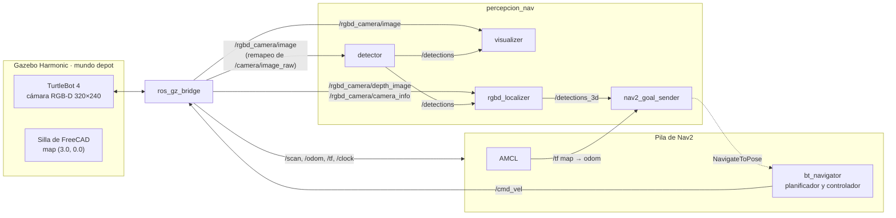

| Tópico del paquete | Tópico de la cámara simulada del TurtleBot 4 |
|---|---|
| `/camera/image_raw` | `/rgbd_camera/image` |
| `/camera/depth/image_raw` | `/rgbd_camera/depth_image` |
| `/camera/camera_info` | `/rgbd_camera/camera_info` |

### Árbol de marcos (REP 103 y REP 105)

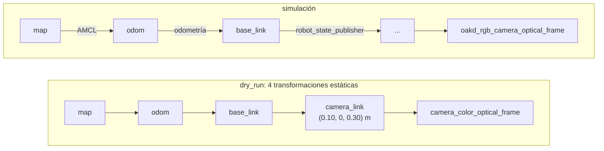

### Calidad de servicio

| Tópico | Publicador | Suscriptores |
|---|---|---|
| Imágenes (`/camera/*`, `/detections_image`) | reliable, profundidad 5 | best effort (perfil de sensor); el detector con profundidad 1 |
| `/detections`, `/detections_3d` | reliable, profundidad 10 | reliable |
| `/goal_pose_preview` | reliable, transient local, profundidad 1 | RViz, `ros2 topic echo` |

---

## Componente RGB-D

El localizador (`rgbd_localizer_node`) recibe `/detections`, la profundidad alineada al color
(`/camera/depth/image_raw`) y los intrínsecos (`/camera/camera_info`). Empareja cada mensaje de
detecciones con la profundidad cuya estampa difiera 20 ms o menos (`sync_slop_sec`).

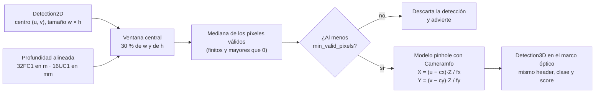

Para cada detección:

1. Toma una ventana central del bbox (30 % de su ancho y alto, `depth_window_fraction`),
   recortada a la imagen de profundidad.
2. Estima `Z` como la **mediana** de los píxeles válidos de la ventana (finitos y mayores que 0).
   La mediana es robusta al fondo que entra en el bbox y a los huecos de la profundidad. Si hay
   menos de `min_valid_pixels` válidos, la detección se descarta con una advertencia.
3. Convierte unidades según la codificación: `32FC1` está en metros; `16UC1` y `mono16` están en
   milímetros (× 0.001).
4. Deproyecta el centro del bbox con el modelo pinhole:
   `X = (u − cx)·Z/fx`, `Y = (v − cy)·Z/fy`, `Z`.

Publica `vision_msgs/Detection3DArray` en `/detections_3d` **en el marco óptico de la cámara**,
con el `header` (estampa y marco) de la detección 2D, la clase y el score de origen, y la
posición en `results[0].pose.pose.position` y `bbox.center.position`.

- **En `dry_run`** no hay cámara RGB-D: `synthetic_depth_node` publica, por cada cuadro del
  video, una profundidad constante (`depth_m`, 2.5 m) y los intrínsecos de una cámara ideal con
  campo de visión `hfov_rad` (1.20 rad), con la misma estampa del cuadro. Así se ejecuta el
  localizador real con las detecciones reales del video.
- **En simulación** la cámara solo ve la cara frontal del objeto. Con `estimate_center: true`
  (`config/params_sim.yaml`) el localizador avanza sobre el rayo la mitad del ancho métrico del
  bbox para estimar el **centro** del objeto, que es la pose real con la que se compara.

---

## Conexión con Nav2

El emisor de metas (`nav2_goal_sender_node`) recibe `/detections_3d` y elige la detección de la
clase objetivo (`target_class`, por defecto `chair`) con mayor score.

**Cadena de tf.** Transforma el punto del marco óptico a `map` con tf2, consultando en la
**estampa de la detección** y con un tiempo límite (`tf_timeout_sec`, 0.2 s). La pose del robot
sale de `map → base_link` en la misma estampa. Si alguna transformación no está disponible,
captura la excepción, advierte (con límite de frecuencia) y no calcula meta.

**Cálculo de la meta.** Con `o` el objeto, `r` el robot y `d` la separación
(`standoff_distance`, 1.0 m):

- Posición: `g = o − d·(o − r)/‖o − r‖`, es decir, a `d` del objeto sobre la línea robot–objeto.
- Orientación: `yaw = atan2(o_y − g_y, o_x − g_x)`, mirando al objeto. Altura: `z = 0`.
- Si `‖o − r‖ ≤ d + t`, con `t` = `arrival_tolerance` (0.30 m), **no** se envía meta. Esto evita
  correcciones repetidas después de llegar.
- Un objetivo que salta más de `max_target_jump` (1.5 m) respecto al último se descarta: los
  objetos son estáticos y ese salto delata un error de estimación.

La meta se publica siempre en `/goal_pose_preview` (`geometry_msgs/PoseStamped`, transient local).

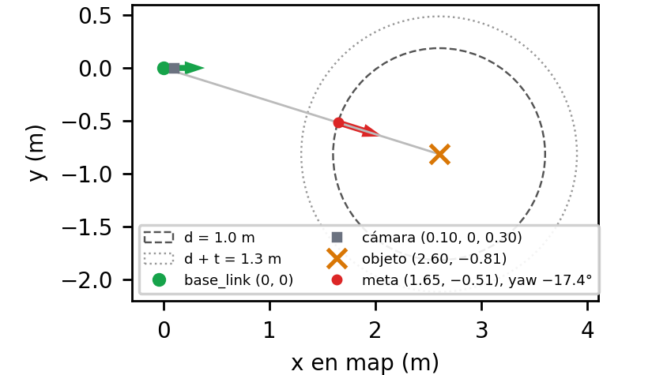

**Ciclo de vida de la acción** (`dry_run:=false`):

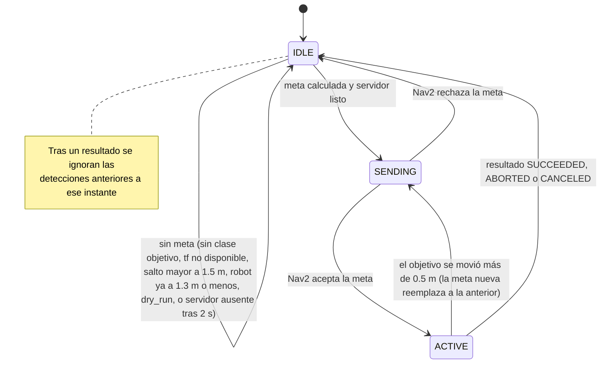

- El nodo espera al servidor `navigate_to_pose` como máximo `server_timeout_sec` (2 s) y envía la
  meta con `NavigateToPose`. Sin servidor, advierte y sigue vivo.
- Registra la aceptación o el rechazo, el progreso (`distance_remaining`) y el resultado.
- Mientras hay una meta en curso no reenvía, salvo que el objetivo se haya movido más de
  `goal_update_threshold` (0.5 m).

---

## Decisiones de diseño

Resumen de cada decisión con su porqué y la alternativa descartada. El detalle está en
[percepcion_nav/docs/decisiones.md](percepcion_nav/docs/decisiones.md) y las verificaciones en
[specs/001-paquete-percepcion-nav/research.md](specs/001-paquete-percepcion-nav/research.md).

| Tema | Decisión | Por qué | Descartado |
|---|---|---|---|
| **Reparto en nodos** | Cinco nodos, uno por responsabilidad, más `synthetic_depth` como herramienta de prueba. Se comunican solo por tópicos, tf2 y una acción. La matemática vive en módulos sin ROS (`geometry.py`, `goal_planning.py`) | Cada pieza se sustituye sin tocar las demás: el video se cambia por la cámara de Gazebo con remapeos y Nav2 por `dry_run` con un parámetro. La matemática se prueba con `pytest` sin ROS | Un nodo monolítico: impide reemplazar piezas y probarlas por separado |
| **Tipos de mensaje** | Solo estándar: `sensor_msgs/Image` y `CameraInfo`, `vision_msgs/Detection2DArray` y `Detection3DArray`, `geometry_msgs/PoseStamped`, `nav2_msgs/action/NavigateToPose` | Interoperan con RViz, Nav2 y `rqt`; la rúbrica penaliza los mensajes personalizados | Mensajes propios con la clase como texto: duplican lo que ya resuelve `vision_msgs` |
| **Calidad de servicio** | Publicadores *reliable*; suscriptores de imagen *best effort*; el detector con cola 1. Detecciones *reliable* | Un suscriptor *best effort* recibe de cualquier publicador (puentes de Gazebo, `rqt`). Con cola 1 el detector procesa siempre el cuadro más reciente y la latencia no se acumula cuando la inferencia es más lenta que la cámara | Perfil de sensor en los publicadores: deja sin datos a los suscriptores *reliable* |
| **Marcos y estampas** | Marcos según REP 103 y 105. El detector copia el `header` de la imagen sin volver a estampar; los datos transformados conservan la estampa | Sin la misma estampa no se emparejan detecciones con su imagen y su profundidad, ni se consulta tf2 en el instante de captura | Volver a estampar en cada nodo |
| **Emparejamiento por estampa** | Visualización: `TimeSynchronizer` exacto. Localizador: `ApproximateTimeSynchronizer` con 20 ms y cola de 30; `CameraInfo` aparte (el último) | Las detecciones llegan con el retraso de la inferencia; la cola de 30 cubre más de 1 s. Los 20 ms toleran cámaras RGB-D reales sin mezclar cuadros (menos de un periodo a 30 fps) | Emparejar por orden de llegada |
| **Imagen anotada como tópico** | `/detections_image`; la ventana local es opcional | Un tópico aparece en `rqt_graph`, se graba en un bag y se ve en remoto | Solo una ventana de OpenCV |
| **Modelo de detección** | YOLO11n preentrenado con COCO (`ultralytics==8.4.174`) en CPU; el nodo verifica que existan los pesos antes de cargarlos | La actividad evalúa integración, no el modelo. El nano rinde más de 5 cuadros/s en CPU y COCO incluye `chair`. La verificación evita descargas silenciosas | YOLO26n (menos historial; se cambia con `model_path`) y entrenar un modelo propio |
| **Estimación de profundidad** | Mediana de los píxeles válidos de una ventana central (30 %) del bbox; pinhole; resultado en el marco óptico | El bbox incluye fondo y la profundidad tiene huecos. Publicar en el marco óptico deja la percepción sin depender del árbol de marcos del robot | Promedio del bbox (sesgado), píxel central (un hueco lo anula), transformar a `map` en el localizador (acopla) |
| **Separación y llegada** | Meta a 1.0 m sobre la línea robot–objeto, mirándolo. No se envía si el robot está a 1.3 m o menos. Se reemplaza solo si el objetivo se mueve más de 0.5 m | El objeto es un obstáculo en el mapa de costos; 1.0 m queda fuera de la zona inscrita (0.22 m) y de la mitad de la silla. El margen de 0.30 m absorbe la tolerancia de llegada de Nav2. El umbral de 0.5 m evita reenvíos por ruido | 0.8 m (cerca del inflado del obstáculo) y 1.5 m (el robot casi no se movería) |
| **`dry_run`** | Parámetro del emisor (verdadero por defecto): calcula con tf2 real y publica `/goal_pose_preview` sin enviar. El launch agrega tf estáticas y profundidad sintética | Ejercita el mismo código sin robot y con números conocidos: con 2.5 m de profundidad, el objeto queda a 2.6 m y la meta a 1.0 m de él | Publicar una detección 3D a mano: no ejercita el localizador ni el emparejamiento |
| **tf2 dentro de callbacks** | Ejecutor multihilo y `TransformListener` con grupo reentrante | Con un solo hilo, una consulta bloqueante nunca recibe `/tf` | `spin_thread=True`: imprimía `ExternalShutdownException` al cerrar |
| **Entorno de Python** | `.venv` con `--system-site-packages`, versiones fijas (`numpy<2`, `opencv-python==4.11.0.86`), shebang `/usr/bin/env python3`, sin `--symlink-install` | PEP 668 impide `pip` global y `cv_bridge` de Jazzy necesita NumPy 1.x. `--symlink-install` ignora el shebang y los nodos no encuentran `ultralytics` | `pip install` en el sistema |
| **Simulación** | TurtleBot 4 mínimo de Nav2 con cámara RGB-D, mundo `depot` y Nav2 real; silla de FreeCAD a 3 m; conexión por remapeos | Así el RGB-D y Nav2 se *ejecutan*, no solo se diseñan, sin construir robot ni mapa | `turtlebot4_simulator` (no instalado, más pesado) y TurtleBot 3 (sin RGB-D) |
| **Nav2 en simulación** | `nav2_params_sim.yaml`: pose inicial de AMCL y `xy_goal_tolerance` de 0.25 a 0.10 m | Sin pose inicial, AMCL espera a que se fije en RViz. Con 0.25 m el robot paraba unos 0.2 m antes de la meta | Publicar `/initialpose` con un temporizador (depende de cuándo arranca AMCL) |
| **Centro frente a cara visible** | `estimate_center: true` en simulación | Con la cara visible la estimación quedó a 0.25 m del centro y el robot a 1.35 m (fuera del límite de 1.30 m). Con la corrección, a 0.04 m | Bajar la separación para compensar (oculta el sesgo) |
| **Silla de FreeCAD** | Macro versionada (`freecad/make_chair.py`): butaca de madera con cojines azules y travesaño frontal | Una primera versión de cajas de un color no se reconocía como silla; la v2 llega a 0.87 desde 3 m | Usar solo un modelo de Fuel (queda como respaldo) |

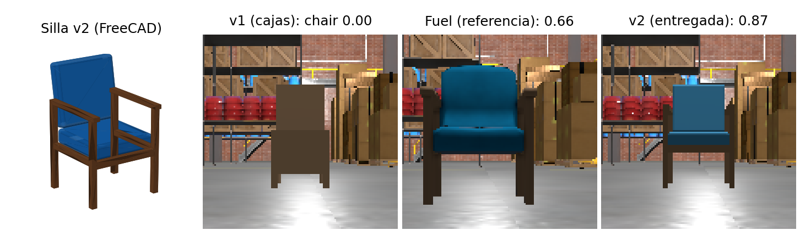

---

## Requisitos

- Ubuntu 24.04 (probado en WSL2) con ROS 2 Jazzy en `/opt/ros/jazzy`.
- CPU; no hace falta GPU.
- Unos 3 GB libres para el entorno de Python (torch CPU + ultralytics).
- Para la simulación: Gazebo Harmonic y Nav2 (se instalan abajo) e internet en el primer
  lanzamiento.

## Instalación

Todos los comandos se ejecutan desde la **raíz del repositorio**, que funciona también como
workspace de colcon (el paquete está en `percepcion_nav/`).

### 1. Paquetes del sistema

```bash
sudo apt update
sudo apt install -y python3-venv python3-pip python3-colcon-common-extensions python3-rosdep \
  ros-jazzy-vision-msgs ros-jazzy-cv-bridge ros-jazzy-message-filters \
  ros-jazzy-tf2-ros ros-jazzy-tf2-geometry-msgs ros-jazzy-nav2-msgs \
  ros-jazzy-rqt-image-view ros-jazzy-rqt-graph ros-jazzy-rviz2
# equivalente a partir de package.xml (si rosdep ya está inicializado):
# rosdep install --from-paths percepcion_nav -y --ignore-src
```

### 2. Entorno de Python

Ubuntu 24.04 no permite `pip install` global (PEP 668), así que se usa un entorno virtual que ve
los paquetes de ROS (`--system-site-packages`):

```bash
source /opt/ros/jazzy/setup.bash
python3 -m venv --system-site-packages .venv
touch .venv/COLCON_IGNORE                 # colcon no debe recorrer el entorno virtual
source .venv/bin/activate
pip install torch torchvision --index-url https://download.pytorch.org/whl/cpu
pip install -r percepcion_nav/requirements.txt
python -c "import numpy, cv_bridge, ultralytics; print(numpy.__version__)"   # debe imprimir 1.x
```

`requirements.txt` fija `numpy<2` (el `cv_bridge` de Jazzy está compilado contra NumPy 1.x),
`opencv-python==4.11.0.86` (la última que acepta NumPy 1.x) y `ultralytics==8.4.174`.

### 3. Pesos del modelo y video de muestra

Ambos vienen dentro del `.zip` entregado. En un clon del repositorio (no se versionan):

```bash
curl -L -o percepcion_nav/models/yolo11n.pt \
  https://github.com/ultralytics/assets/releases/download/v8.3.0/yolo11n.pt
mkdir -p percepcion_nav/media
cp /ruta/a/tu_video.mp4 percepcion_nav/media/sample.mp4   # o usa el argumento video:=...
```

### 4. Dependencias de la simulación

```bash
sudo apt install -y ros-jazzy-navigation2 ros-jazzy-nav2-bringup ros-jazzy-nav2-minimal-tb4-sim \
  ros-jazzy-ros-gz
```

El **primer** lanzamiento de la simulación necesita internet: el mundo `depot` descarga su modelo
de Gazebo Fuel (queda en `~/.gz/fuel`).

## Compilación y pruebas

```bash
source /opt/ros/jazzy/setup.bash
source .venv/bin/activate
colcon build                          # importante: SIN --symlink-install (ver Problemas conocidos)
source install/setup.bash
colcon test --packages-select percepcion_nav && colcon test-result --verbose
```

Las pruebas de la lógica numérica (deproyección, mediana, unidades, cálculo de la meta) también
corren sin ROS:

```bash
python -m pytest percepcion_nav/test/test_geometry.py percepcion_nav/test/test_goal_planning.py
```

## Ejecución

En cada terminal nueva:

```bash
source /opt/ros/jazzy/setup.bash && source .venv/bin/activate && source install/setup.bash
```

### Demostración completa en una sola terminal

```bash
percepcion_nav/scripts/demo.sh
```

Carga el entorno, compila si hace falta y recorre todo con **Enter** entre partes:

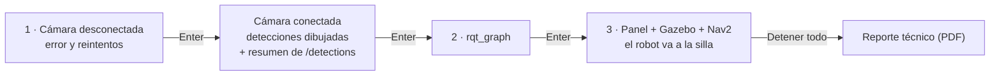

Usa `media/sample.mp4`, o el video de prueba si aquel no existe.

### Pipeline 2D (cámara → detector → visualización)

```bash
ros2 launch percepcion_nav pipeline_2d.launch.py
```

| Argumento | Defecto | Uso |
|---|---|---|
| `video` | `share/percepcion_nav/media/sample.mp4` | Ruta del video, o índice de dispositivo (`"0"`) |
| `model` | `share/percepcion_nav/models/yolo11n.pt` | Pesos de YOLO |
| `params_file` | `share/percepcion_nav/config/params.yaml` | Parámetros de los nodos |
| `viewer` | `true` | Abre `rqt_image_view` sobre `/detections_image` |

Los parámetros de cada nodo, con su valor por defecto y su propósito, están en
[percepcion_nav/config/params.yaml](percepcion_nav/config/params.yaml).

### Sistema completo en `dry_run` (sin robot ni Gazebo)

```bash
ros2 launch percepcion_nav dry_run.launch.py            # use_rviz:=false para no abrir RViz
ros2 topic echo /detections_3d --once                    # z ≈ 2.5 m (profundidad sintética)
ros2 topic echo /goal_pose_preview --once                # meta en map, 1.0 m antes del objeto
```

Lanza la cámara, el detector, la visualización, `synthetic_depth`, el localizador y el emisor con
`dry_run:=true`, más las cuatro transformaciones estáticas
`map → odom → base_link → camera_link → camera_color_optical_frame` (cámara en
`(0.10, 0, 0.30)` m). Los nombres de marco y esa posición son argumentos del launch
(`map_frame`, `odom_frame`, `base_frame`, `camera_link_frame`, `optical_frame`, `cam_x`, `cam_y`,
`cam_z`).

Para probar casos de error:

```bash
# Transformación no disponible: segunda instancia hacia un marco inexistente
ros2 run percepcion_nav nav2_goal_sender_node --ros-args -r __node:=goal_sender_tf_test \
  -p map_frame:=frame_inexistente -r goal_pose_preview:=/goal_preview_tf_test
# Servidor de acción ausente
ros2 param set /nav2_goal_sender dry_run false
```

### Simulación en Gazebo con Nav2

```bash
ros2 launch percepcion_nav simulation.launch.py              # headless:=False para ver Gazebo
```

Lanza Gazebo Harmonic con el TurtleBot 4 mínimo de Nav2, su pila de navegación y RViz; inserta
la silla de FreeCAD a 3 m frente al robot; y lanza el detector, la visualización, el localizador
y el emisor de metas (`dry_run:=false`) conectados a la cámara simulada por remapeos. AMCL se
localiza solo. El robot detecta la silla, estima su posición y navega hasta quedar a 1 m,
mirándola.

| Argumento | Defecto | Uso |
|---|---|---|
| `headless` | `True` | Sin la interfaz de Gazebo. `True`/`False` con mayúscula (Nav2 lo evalúa en Python) |
| `use_rviz` | `true` | RViz de Nav2 |
| `viewer` | `true` | `rqt_image_view` sobre `/detections_image` |
| `dry_run` | `false` | `true` arranca sin enviar metas; luego `ros2 param set /nav2_goal_sender dry_run false` inicia la navegación |
| `chair_model` | `freecad_chair` | Modelo del paquete, o URL de Fuel como respaldo |
| `chair_x`, `chair_y`, `chair_yaw` | `-5.0`, `0.0`, `3.1416` | Pose **real** de la silla en el mundo; en `map` es `(chair_x + 8, chair_y)` |
| `chair_spawn_delay` | `10.0` | Espera antes de insertar la silla, en s |

En WSL2 sin GPU, Gazebo dibuja por software y corre a ~0.5× el tiempo real. Todos los nodos usan
el reloj de la simulación (`use_sim_time`), así que el sistema sigue siendo correcto, aunque más
lento.

**Panel de simulación.** Un solo comando abre el panel e inicia la simulación (carga el entorno y
compila si hace falta):

```bash
percepcion_nav/scripts/simulacion_silla.sh       # o: ros2 run percepcion_nav sim_panel [--autostart]
```

Botones: **▶ Iniciar simulación**, **→ Iniciar navegación**, **■ Detener todo** (sin dejar
procesos vivos) y **⟳ Reiniciar**. Con la opción *esperar para navegar*, el robot ve la silla y
publica la meta, pero no se mueve hasta pulsar "Iniciar navegación". Equivalente sin panel:

```bash
ros2 launch percepcion_nav simulation.launch.py headless:=False dry_run:=true
ros2 param set /nav2_goal_sender dry_run false        # en otra terminal, cuando se quiera navegar
```

**La silla de FreeCAD** se genera con la macro `percepcion_nav/freecad/make_chair.py`. Las mallas
(`models/freecad_chair/meshes/*.stl`) se versionan, así que para ejecutar no hace falta FreeCAD.
Para regenerarlas: `freecadcmd percepcion_nav/freecad/make_chair.py`.

## Verificación

```bash
ros2 topic echo /detections --once          # header = el de la imagen; bbox, clase y score
ros2 topic hz /detections                   # >= 5 Hz en CPU
ros2 topic echo /camera/image_raw --once --field header
ros2 run rqt_graph rqt_graph                # debe coincidir con el diagrama de nodos
ros2 launch percepcion_nav pipeline_2d.launch.py video:=/tmp/no_existe.mp4   # error + reintentos
```

---

## Resultados

### Pipeline 2D

| Medición | Resultado |
|---|---|
| Detecciones por segundo en CPU (YOLO11n, 640 px) | 5.3–8.9 |
| Primera imagen anotada desde el lanzamiento | 5.8 s |
| Recuperación tras conectar una fuente inexistente | 1.9 s (reintento cada 2 s) |
| `header` de `/detections` frente al de la imagen | Idéntico (estampa y marco) |

### `dry_run`

Con profundidad sintética de 2.5 m, `/detections_3d` publica `z = 2.50` m en el marco óptico y
la meta queda a 1.000 m del objeto en `map`, orientada hacia él y con `z = 0`.

### Simulación: 5 corridas independientes con Nav2 real

| Corrida | Objetivo estimado en `map` | Error frente al centro real (≤ 0.30 m) | Distancia final al centro (1.0 ± 0.30 m) | Error de orientación (≤ 15°) | Resultado |
|---|---|---|---|---|---|
| 1 | (3.04, 0.01) | 0.04 m ✓ | 1.025 m ✓ | 1.4° ✓ | `SUCCEEDED` |
| 2 | (3.04, 0.01) | 0.04 m ✓ | 1.088 m ✓ | 1.3° ✓ | `SUCCEEDED` |
| 3 | (3.04, 0.01) | 0.04 m ✓ | 1.071 m ✓ | 0.9° ✓ | `SUCCEEDED` |
| 4 | (3.04, 0.01) | 0.04 m ✓ | 1.097 m ✓ | 2.2° ✓ | `SUCCEEDED` |
| 5 | (3.04, 0.01) | 0.04 m ✓ | 1.082 m ✓ | 2.2° ✓ | `SUCCEEDED` |

La silla real está en `map (3.0, 0.0)`. En cada corrida Nav2 aceptó una sola meta y no se enviaron
metas nuevas después de llegar. Detalle completo en
[percepcion_nav/docs/validacion_simulacion.md](percepcion_nav/docs/validacion_simulacion.md).

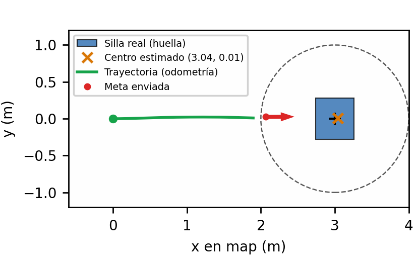

## Validado frente a diseño

| Componente | Cómo se validó | Qué quedó sin probar |
|---|---|---|
| Nodo de cámara | Ejecución real con video; fuente inexistente con reintentos y recuperación en 1.9 s; fin de video con `loop:=false` termina con código 0 | Webcam física (WSL2 no la expone) |
| Detector | Ejecución real; `Detection2DArray` con `header` idéntico al de la imagen, bbox, clase y score en [0, 1]; 5.3–8.9 detecciones/s en CPU; prueba `test_detection_msgs.py` | Rendimiento con GPU |
| Visualización | Ejecución real: primera imagen anotada a los 5.8 s | Nada |
| Localizador RGB-D | Pruebas `pytest` sin ROS (deproyección con error < 1 mm, mediana con ceros, NaN e infinitos, mm → m, ventana en el borde); `dry_run` real; simulación completa | Profundidad de un sensor real: ruido, huecos y alineación |
| Emisor de metas | Pruebas `pytest` sin ROS (meta a 1.0 ± 0.01 m, orientación < 1°, tolerancia, umbral de reemplazo, selección por score); `dry_run` real; marco inexistente y servidor ausente sin caerse | Servidor Nav2 de un robot físico |
| Simulación de extremo a extremo | 5 corridas en Gazebo con Nav2 real: 5/5 `SUCCEEDED`, estimación a 0.04 m, llegada a 1.03–1.10 m | Robot y sensor físicos; la pose real es la odometría ideal de Gazebo |

En resumen: la cámara, el detector y la visualización se validaron con video real; el RGB-D y
Nav2, con pruebas automáticas y la simulación completa. **No se probó hardware físico**: ni cámara
RGB-D real ni robot. La tabla con la evidencia de cada fila está en
[percepcion_nav/README.md](percepcion_nav/README.md#validado-frente-a-diseño).

Las mediciones del pipeline 2D se hicieron con un video de prueba construido a partir de cuadros
del conjunto KITTI; el video grabado con el celular (`sample.mp4`) lo reemplaza en la
demostración.

## Problemas conocidos

- **`No module named 'ultralytics'` al lanzar**: el paquete se compiló con `--symlink-install`,
  que ignora el shebang `/usr/bin/env python3` de `setup.cfg` y deja los ejecutables con
  `/usr/bin/python3`, que no ve el `.venv`. Solución: `rm -rf build install log && colcon build`
  con el `.venv` activo.
- **`cv_bridge` falla con NumPy 2**: instala con `requirements.txt` (fija `numpy<2` y OpenCV
  4.11). OpenCV 4.12 o posterior exige NumPy 2.
- **Sin webcam en WSL2**: WSL2 no expone `/dev/video*`. La fuente por defecto es un video; una
  webcam USB puede conectarse con `usbipd` y usarse con `video:=0`.
- **Rendimiento**: en CPU, YOLO11n a 640 px rinde entre 5 y 9 cuadros/s. Si se necesita más, usa
  `imgsz: 320` en `config/params.yaml`.
- **`name 'true' is not defined` al lanzar la simulación**: `headless` debe ser `True` o `False`
  con mayúscula.
- **Metas rechazadas al arrancar la simulación**: durante los primeros segundos Nav2 todavía no
  está activo. El emisor lo avisa (con límite de frecuencia) y reintenta con la siguiente
  detección.

## Limitaciones

- No hay pruebas con hardware: ni webcam, ni cámara RGB-D, ni robot físico.
- La pose real del robot en simulación es la odometría ideal de Gazebo, no un sistema de medición
  independiente.
- El localizador supone profundidad alineada al color, con la misma resolución.
  `estimate_center` supone además una huella cuadrada.
- A 1 m de la silla, esta queda cortada en la imagen y deja de detectarse. No afecta la llegada,
  pero el sistema no sigue al objeto a esa distancia.

---

## Estructura del repositorio

```text
.                                   # raíz = workspace de colcon
├── README.md                       # este archivo
├── percepcion_nav/                 # el paquete ROS 2 (lo que se entrega en el .zip)
│   ├── percepcion_nav/             # nodos y módulos sin ROS (geometry.py, goal_planning.py)
│   ├── launch/                     # pipeline_2d, dry_run y simulation
│   ├── config/                     # params.yaml, params_sim.yaml, nav2_params_sim.yaml
│   ├── test/                       # pytest, flake8 y pep257
│   ├── scripts/                    # demo.sh, simulacion_silla.sh
│   ├── models/                     # silla de FreeCAD (SDF + STL) y pesos de YOLO
│   ├── freecad/                    # macro y archivo de la silla
│   ├── rviz/                       # configuración de RViz
│   └── docs/                       # diagrama, decisiones, validación, figuras y reporte técnico
├── specs/001-paquete-percepcion-nav/   # especificación, plan, contratos y tareas (Spec Kit)
└── .specify/memory/constitution.md     # principios del proyecto
```

## Documentación adicional y créditos

- Guía detallada del paquete: [percepcion_nav/README.md](percepcion_nav/README.md).
- Diagrama de nodos, modos, remapeos y QoS:
  [percepcion_nav/docs/diagrama_nodos.md](percepcion_nav/docs/diagrama_nodos.md).
- Decisiones de diseño completas: [percepcion_nav/docs/decisiones.md](percepcion_nav/docs/decisiones.md).
- Validación en simulación: [percepcion_nav/docs/validacion_simulacion.md](percepcion_nav/docs/validacion_simulacion.md).
- Reporte técnico (2 páginas):
  [percepcion_nav/docs/reporte/reporte_tecnico.tex](percepcion_nav/docs/reporte/reporte_tecnico.tex);
  para compilarlo, `cd percepcion_nav/docs/reporte && pdflatex reporte_tecnico.tex` (dos veces).
- Especificación, plan, contratos y tareas: [specs/001-paquete-percepcion-nav/](specs/001-paquete-percepcion-nav/).
- Principios del proyecto: [.specify/memory/constitution.md](.specify/memory/constitution.md).

**Créditos de datos**: las capturas del pipeline 2D usan cuadros de *KITTI Vision Benchmark
Suite* (Geiger et al., 2013), con licencia CC BY-NC-SA 3.0, en un uso académico y no comercial.
