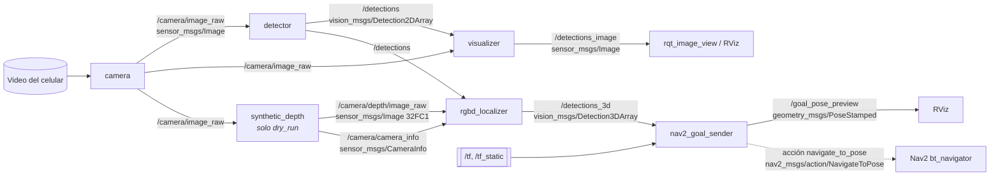

# Diagrama de nodos y tópicos

Fuente: `specs/001-paquete-percepcion-nav/contracts/ros-interfaces.md`. Debe coincidir con
`rqt_graph` del sistema en ejecución (capturas en [img/](img/)).



Línea continua: tópico. Línea punteada: acción (solo con `dry_run:=false`).

## Qué se lanza en cada modo

| Nodo | `pipeline_2d` | `dry_run` | `simulation` |
|---|---|---|---|
| `camera` | sí | sí | no (la imagen viene de Gazebo) |
| `detector` | sí | sí | sí |
| `visualizer` | sí | sí | sí |
| `synthetic_depth` | no | sí | no |
| `rgbd_localizer` | no | sí | sí |
| `nav2_goal_sender` | no | sí (`dry_run:=true`) | sí (`dry_run:=false`) |
| tf | — | 4 `static_transform_publisher` | Gazebo, `robot_state_publisher`, AMCL |

## Remapeos en simulación

| Tópico del paquete | Tópico de la cámara simulada del TurtleBot 4 |
|---|---|
| `/camera/image_raw` | `/rgbd_camera/image` |
| `/camera/depth/image_raw` | `/rgbd_camera/depth_image` |
| `/camera/camera_info` | `/rgbd_camera/camera_info` |

## Árbol de marcos (REP 105)

```text
map ─► odom ─► base_link ─► camera_link ─► camera_color_optical_frame     (dry_run)
map ─► odom ─► base_link ─► … ─► oakd_rgb_camera_optical_frame            (simulación)
```

## Calidad de servicio

| Tópico | Publicador | Suscriptores |
|---|---|---|
| Imágenes (`/camera/*`, `/detections_image`) | reliable, profundidad 5 | best effort (perfil de sensor) |
| `/detections`, `/detections_3d` | reliable, profundidad 10 | reliable |
| `/goal_pose_preview` | reliable, transient local, profundidad 1 | RViz, `ros2 topic echo` |
