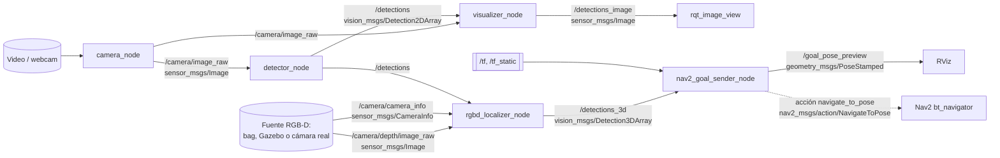

# Pre-spec: Paquete ROS 2 de Percepción para Navegación

**Curso**: MPIAF-12 Visión Inteligente (Maestría en IA, TecNM Atlixco), Tema 5, actividad integradora
**Estado**: Borrador previo a `/speckit-specify`. No se ha ejecutado ni generado código.
**Fuente de requisitos**: página de la actividad en Moodle (descripción, requisitos técnicos mínimos, entregables y rúbrica).
---

## 1. Objetivo

Construir un paquete ROS 2 que integre en un solo pipeline de nodos desacoplados lo visto en el Tema 5:

1. un nodo de cámara que publica `sensor_msgs/Image`,
2. un nodo detector que publica `vision_msgs/Detection2DArray`,
3. una verificación visual del pipeline de extremo a extremo,
4. un componente RGB-D que obtiene la posición 3D de un objeto detectado,
5. un cliente de acción que envía una meta a Nav2 a partir de esa posición 3D,
6. documentación: diagrama de nodos y tópicos, README ejecutable y decisiones de diseño.

La actividad evalúa integración de sistemas, no la calidad del modelo. La meta de este pre-spec es alcanzar el nivel **Sobresaliente** en los seis criterios de la rúbrica.

## 2. Entorno detectado y sus consecuencias

| Hecho observado | Consecuencia para el diseño |
|---|---|
| Ubuntu 24.04 sobre WSL2 | Entorno de desarrollo y de grabación del video |
| ROS 2 **Jazzy** instalado en `/opt/ros/jazzy` | Distro objetivo; `vision_msgs` 4.x (campos `hypothesis.class_id`, `bbox.center.position`) |
| No existe `/dev/video*` | No hay webcam accesible; la fuente por defecto será un **video grabado** (permitido por el requisito 5.1) |
| Repositorio vacío salvo Spec Kit, sin git inicializado | El paquete se crea desde cero; la constitución está sin llenar |

## 3. Alcance

**Dentro del alcance**

- Paquete `ament_python` llamado `percepcion_nav` con cinco nodos, launch files, archivo de parámetros, pruebas y documentación.
- Pipeline cámara → detección → visualización **ejecutado y grabado en video**.
- Componente RGB-D y cliente Nav2 **implementados en código**, validados sin hardware mediante pruebas unitarias y un modo `dry_run` con transformaciones estáticas.
- Reporte técnico de 1 a 2 páginas con la tabla de "validado vs. diseño" y la autoevaluación de la rúbrica.

**Fuera del alcance**

- Entrenar o mejorar el modelo de detección (se usa uno preentrenado del Tema 3).
- Mensajes personalizados (la rúbrica los penaliza; solo tipos estándar).
- Ejecución contra un robot físico.
- Simulación completa en Gazebo con Nav2: queda como extensión opcional (ver sección 12).

## 4. Estrategia ante el hardware disponible

La actividad permite tres caminos: (a) bag o dataset RGB-D público, (b) simulación en Gazebo, (c) implementar y documentar sin ejecutar contra robot real.

**Propuesta: camino (c) como base, con validación parcial real.**

- La parte 2D (cámara, detector, visualización) se ejecuta de verdad con un video grabado.
- La parte RGB-D se implementa y se valida con pruebas unitarias sobre profundidad sintética e intrínsecos conocidos.
- El cliente Nav2 se implementa completo y se ejercita en `dry_run`: calcula la meta usando tf2 real contra transformaciones estáticas, y la publica en un tópico de vista previa sin enviarla al servidor de acción.
- El reporte declara con precisión qué se validó y qué quedó como diseño no probado.

Motivo: cabe en las 4 a 5 horas sugeridas, no depende de GPU ni de Gazebo en WSL2, y la rúbrica otorga Sobresaliente explícitamente "aunque no se ejecute en robot real".

## 5. Arquitectura propuesta

### 5.1 Diagrama de nodos y tópicos



Línea continua: tópicos. Línea punteada: acción (no se ejecuta contra robot real).

### 5.2 Contrato de interfaces

| Nombre | Tipo | Publica | Suscribe | QoS |
|---|---|---|---|---|
| `/camera/image_raw` | `sensor_msgs/Image` (`bgr8`) | `camera_node` | `detector_node`, `visualizer_node` | Sensor data (best effort, cola corta) |
| `/camera/camera_info` | `sensor_msgs/CameraInfo` | fuente RGB-D | `rgbd_localizer_node` | Sensor data |
| `/camera/depth/image_raw` | `sensor_msgs/Image` (`16UC1` mm o `32FC1` m) | fuente RGB-D | `rgbd_localizer_node` | Sensor data |
| `/detections` | `vision_msgs/Detection2DArray` | `detector_node` | `visualizer_node`, `rgbd_localizer_node` | Reliable, profundidad 10 |
| `/detections_image` | `sensor_msgs/Image` | `visualizer_node` | `rqt_image_view`, RViz | Sensor data |
| `/detections_3d` | `vision_msgs/Detection3DArray` | `rgbd_localizer_node` | `nav2_goal_sender_node` | Reliable, profundidad 10 |
| `/goal_pose_preview` | `geometry_msgs/PoseStamped` | `nav2_goal_sender_node` | RViz | Reliable |
| `navigate_to_pose` | acción `nav2_msgs/action/NavigateToPose` | cliente: `nav2_goal_sender_node` | servidor: Nav2 | por defecto de acciones |

Todos los nombres son remapeables para conectar una cámara real, un bag o Gazebo sin tocar código.

### 5.3 Marcos de referencia (tf2)

Cadena esperada: `map → odom → base_link → camera_link → camera_color_optical_frame`.

| Transformación | Quién la publica en un robot real | En `dry_run` |
|---|---|---|
| `map → odom` | AMCL o SLAM | `static_transform_publisher` |
| `odom → base_link` | Odometría | `static_transform_publisher` |
| `base_link → camera_*` | `robot_state_publisher` (URDF) | `static_transform_publisher` |

El marco óptico sigue REP 103: Z hacia adelante, X a la derecha, Y hacia abajo. La deproyección produce puntos en ese marco.

## 6. Historias de usuario priorizadas

### HU1 (P1): Pipeline 2D de extremo a extremo

Como evaluador, quiero lanzar un solo comando y ver las detecciones dibujadas sobre la imagen, para confirmar que cámara, detector y visualización se comunican.

- **Prueba independiente**: `ros2 launch percepcion_nav pipeline.launch.py` con un video de muestra; se ve la imagen anotada y `ros2 topic echo /detections` muestra mensajes poblados.
- **Escenarios de aceptación**:
  1. Dado un video válido, cuando se lanza el pipeline, entonces `/camera/image_raw` publica con `header.stamp` creciente y `frame_id` no vacío.
  2. Dado un cuadro con objetos de clases conocidas, cuando el detector lo procesa, entonces publica un `Detection2DArray` cuyo `header` es idéntico al de la imagen y cada detección trae bbox, clase y score.
  3. Dado un cuadro sin objetos, cuando el detector lo procesa, entonces publica un arreglo vacío con el `header` de la imagen.
  4. Dada la fuente desconectada o el archivo inexistente, cuando el nodo de cámara arranca o pierde la fuente, entonces registra el error, no se cae y reintenta la conexión periódicamente.

### HU2 (P2): Posición 3D de un objeto detectado

Como integrador, quiero convertir una detección 2D más profundidad e intrínsecos en un punto 3D en el marco de la cámara, para alimentar a la navegación.

- **Prueba independiente**: pruebas unitarias de la función de deproyección con profundidad sintética; opcionalmente, ejecución con un bag RGB-D.
- **Escenarios de aceptación**:
  1. Dados `K` conocidos y profundidad constante `Z`, cuando se deproyecta el píxel `(u, v)`, entonces el resultado es `X = (u − cx)·Z/fx`, `Y = (v − cy)·Z/fy`, `Z`.
  2. Dada una región con ceros o NaN en la profundidad, cuando se estima `Z`, entonces se usa la mediana de los valores válidos de una ventana central del bbox; si no hay valores válidos, la detección se descarta con una advertencia.
  3. Dada profundidad en `16UC1`, cuando se procesa, entonces se convierte de milímetros a metros.

### HU3 (P3): Meta de navegación hacia el objeto

Como integrador, quiero que una detección 3D de la clase objetivo se convierta en una meta `NavigateToPose` en el marco `map`, para que el robot se acerque al objeto.

- **Prueba independiente**: lanzar el nodo en `dry_run` con transformaciones estáticas y una detección 3D publicada a mano; verificar la pose en `/goal_pose_preview`.
- **Escenarios de aceptación**:
  1. Dada una detección 3D en el marco óptico y la cadena de tf disponible, cuando llega la detección, entonces el punto se transforma a `map` y se calcula una meta a una distancia de separación del objeto, orientada hacia él.
  2. Dado que la transformación no está disponible, cuando llega la detección, entonces se captura `TransformException`, se registra una advertencia y no se envía meta.
  3. Dado `dry_run:=false` y el servidor de acción ausente, cuando se intenta enviar, entonces `wait_for_server` expira y el nodo lo reporta sin bloquearse.
  4. Dada una meta activa, cuando llega otra detección del mismo objeto a menos de un umbral de distancia, entonces no se reenvía la meta.

### HU4 (P1): Documentación y entregables

Como evaluador, quiero un README que pueda seguir paso a paso y un diagrama claro, para reproducir la demo y entender las decisiones.

- **Escenarios de aceptación**:
  1. Dado un Ubuntu 24.04 con Jazzy limpio, cuando sigo el README, entonces compilo y lanzo el pipeline sin pasos faltantes.
  2. Dado el reporte, cuando lo leo, entonces encuentro el diagrama, las decisiones justificadas y la tabla de lo validado frente a lo diseñado.

## 7. Requisitos funcionales

### Nodo de cámara (`camera_node`)

- **FR-001**: Debe publicar `sensor_msgs/Image` en `/camera/image_raw` convirtiendo con `cv_bridge`.
- **FR-002**: La fuente debe ser configurable por parámetro `source`: ruta de video o índice de dispositivo. Otros parámetros: `fps`, `frame_id`, `loop`.
- **FR-003**: Cada mensaje debe llevar `header.stamp` del reloj del nodo y `header.frame_id` configurado.
- **FR-004**: Si la fuente no abre, debe registrar el error y reintentar con un temporizador, sin terminar el proceso.
- **FR-005**: Si falla la lectura de un cuadro, debe registrar una advertencia limitada en frecuencia, liberar la captura e intentar reconectar. Al terminar un video, debe reiniciarlo si `loop` es verdadero o apagarse limpiamente si no.
- **FR-006**: Debe liberar la captura al destruir el nodo.

### Nodo detector (`detector_node`)

- **FR-010**: Debe suscribirse a `/camera/image_raw` con cola de tamaño 1 para descartar cuadros atrasados.
- **FR-011**: Debe ejecutar un modelo de detección preentrenado (propuesta: YOLO nano con pesos COCO) configurable con `model_path`, `conf_threshold`, `device` y `target_classes`.
- **FR-012**: Debe publicar `vision_msgs/Detection2DArray` en `/detections`, sin mensajes personalizados.
- **FR-013**: El `header` del arreglo y de cada `Detection2D` debe copiarse de la imagen de entrada.
- **FR-014**: Cada `Detection2D` debe poblar:
  - `bbox.center.position.x`, `bbox.center.position.y` en píxeles, `bbox.center.theta = 0`,
  - `bbox.size_x`, `bbox.size_y` en píxeles,
  - `results[0].hypothesis.class_id` con el nombre de la clase,
  - `results[0].hypothesis.score` en el rango 0 a 1.
- **FR-015**: Debe publicar un arreglo vacío cuando no haya detecciones.
- **FR-016**: Si el modelo no carga, debe fallar al arranque con un mensaje claro. Si falla la conversión de un cuadro, debe descartarlo y continuar.

### Verificación visual (`visualizer_node`)

- **FR-020**: Debe sincronizar imagen y detecciones por estampa de tiempo con `message_filters`.
- **FR-021**: Debe dibujar rectángulo, clase y score de cada detección.
- **FR-022**: Debe publicar la imagen anotada en `/detections_image` y, de forma opcional por parámetro, abrir una ventana local.

### Componente RGB-D (`rgbd_localizer_node`)

- **FR-030**: Debe suscribirse a `/detections`, a la profundidad alineada al color y a `camera_info`, sincronizando detecciones y profundidad.
- **FR-031**: Debe leer `fx`, `fy`, `cx`, `cy` de `CameraInfo.k`.
- **FR-032**: Debe estimar la profundidad de cada detección con la mediana de valores válidos en una ventana central del bbox, convirtiendo unidades según la codificación.
- **FR-033**: Debe deproyectar con el modelo pinhole y publicar `vision_msgs/Detection3DArray` en `/detections_3d`, con el `frame_id` del marco óptico, conservando clase y score y poblando la posición en `results[0].pose.pose.position` y `bbox.center.position`.
- **FR-034**: La matemática debe vivir en funciones puras, separadas del nodo, para probarse sin ROS.

### Conexión con Nav2 (`nav2_goal_sender_node`)

- **FR-040**: Debe suscribirse a `/detections_3d` y seleccionar la detección de `target_class` con mayor score.
- **FR-041**: Debe transformar el punto al marco `map` usando `tf2_ros.Buffer` y `TransformListener`, con la estampa de la detección y un tiempo de espera, capturando `TransformException`.
- **FR-042**: Debe calcular la meta a `standoff_distance` del objeto sobre la línea robot–objeto, con `z = 0` y orientación mirando al objeto. Si el robot ya está dentro de esa distancia, no envía meta.
- **FR-043**: Debe enviar la meta con un `ActionClient` de `nav2_msgs/action/NavigateToPose` sobre `navigate_to_pose`, con `wait_for_server` con tiempo límite y callbacks de respuesta, retroalimentación y resultado.
- **FR-044**: No debe reenviar metas mientras haya una activa, salvo que el objetivo se haya movido más de un umbral.
- **FR-045**: Debe ofrecer el parámetro `dry_run` (verdadero por defecto) que publica la meta en `/goal_pose_preview` sin enviarla.

### Paquete y documentación

- **FR-050**: El paquete debe incluir `package.xml` con todas las dependencias, `setup.py` con los cinco puntos de entrada, `setup.cfg`, `resource/`, `launch/`, `config/params.yaml` y `test/`.
- **FR-051**: Debe incluir `pipeline.launch.py` (cámara, detector, visualizador) y `perception_nav.launch.py` (sistema completo con `dry_run`).
- **FR-052**: El README debe cubrir requisitos, instalación, compilación, ejecución de cada launch, parámetros, comandos de verificación y problemas conocidos.
- **FR-053**: La documentación debe incluir el diagrama de nodos y tópicos más una captura de `rqt_graph` del sistema en ejecución.

## 8. Estructura prevista del paquete

```text
percepcion_nav/
├── package.xml
├── setup.py
├── setup.cfg
├── resource/percepcion_nav
├── percepcion_nav/
│   ├── __init__.py
│   ├── camera_node.py
│   ├── detector_node.py
│   ├── visualizer_node.py
│   ├── rgbd_localizer_node.py
│   ├── nav2_goal_sender_node.py
│   └── geometry.py            # deproyección y cálculo de meta, sin ROS
├── launch/
│   ├── pipeline.launch.py
│   └── perception_nav.launch.py
├── config/params.yaml
├── test/
│   ├── test_geometry.py
│   └── test_detection_msg.py
├── docs/
│   ├── diagrama_nodos.md
│   ├── rqt_graph.png
│   └── reporte_tecnico.pdf
└── README.md
```

Dependencias ROS: `rclpy`, `sensor_msgs`, `vision_msgs`, `geometry_msgs`, `cv_bridge`, `message_filters`, `tf2_ros`, `tf2_geometry_msgs`, `nav2_msgs`.
Dependencias Python: OpenCV, NumPy y la librería del modelo de detección.

## 9. Decisiones de diseño que hay que poder defender

La actividad advierte que se puede pedir explicar cualquier decisión del diagrama. Estas son las propuestas y su porqué; conviene revisarlas y ajustarlas antes de adoptarlas.

| Decisión | Por qué |
|---|---|
| Cinco nodos separados en lugar de uno | Cada pieza se sustituye sin tocar las demás: la cámara por un bag o Gazebo, el modelo por otro, Nav2 real por `dry_run` |
| Solo tipos estándar (`vision_msgs`, `sensor_msgs`, `nav2_msgs`) | Interoperabilidad con RViz y otros paquetes; la rúbrica penaliza mensajes personalizados |
| El detector copia el `header` de la imagen | Permite sincronizar detecciones con imagen y profundidad por estampa exacta, y hacer la consulta de tf en el instante de captura |
| QoS de sensor en imágenes, reliable en detecciones | En imágenes es preferible perder un cuadro que acumular latencia; las detecciones son pequeñas y no deben perderse |
| Cola de tamaño 1 en la suscripción del detector | Si la inferencia es más lenta que la cámara, se procesa siempre el cuadro más reciente |
| Publicar la imagen anotada como tópico | Aparece en `rqt_graph`, se puede grabar en un bag y ver en remoto; una ventana local no |
| Mediana en una ventana central del bbox | El bbox incluye fondo y la profundidad tiene huecos; la mediana central es robusta a ambos |
| `Detection3DArray` en el marco óptico, sin transformar | El localizador no necesita conocer el robot; la transformación a `map` es responsabilidad de quien navega |
| Meta con distancia de separación | El objeto es un obstáculo en el costmap; una meta sobre él sería inalcanzable |
| `dry_run` con transformaciones estáticas | Ejercita el código real de tf2 y el cálculo de la meta sin robot ni Nav2 |
| Matemática en funciones puras | Se prueba con `pytest` sin levantar ROS, lo que da evidencia de validación sin hardware |

## 10. Entregables

| Entregable | Contenido | Restricción de Moodle |
|---|---|---|
| Paquete ROS 2 | Código completo en `.zip`, sin `build/`, `install/` ni `log/` | 50 MB por archivo |
| Video de demostración | 2 a 4 minutos, ver guion abajo | 50 MB; comprimir o subir enlace si excede |
| Reporte técnico | PDF de 1 a 2 páginas | Máximo 20 archivos en total |

**Guion del video**

1. `colcon build` y `ros2 launch percepcion_nav pipeline.launch.py`.
2. `rqt_image_view` mostrando `/detections_image`.
3. `ros2 topic echo /detections --once` señalando bbox, clase y score, y `ros2 topic hz`.
4. `rqt_graph` con la cadena de nodos.
5. Manejo de errores: lanzar con una fuente inexistente y mostrar el log de reintento.
6. `perception_nav.launch.py` en `dry_run`: publicar una detección 3D de prueba y mostrar la meta en `/goal_pose_preview`.
7. Cierre declarando qué se validó y qué quedó como diseño.

**Esquema del reporte**

1. Diagrama de nodos y tópicos.
2. Decisiones de diseño (resumen de la sección 9).
3. Componente RGB-D: ecuaciones, supuestos y manejo de profundidad inválida.
4. Conexión con Nav2: cadena de tf, cálculo de la meta, ciclo de vida de la acción.
5. Tabla de validado frente a diseño (sección 11).
6. Autoevaluación con la rúbrica, criterio por criterio en escala de 0 a 4.

## 11. Validado frente a diseño (plan)

| Componente | Cómo se valida | Qué queda como diseño |
|---|---|---|
| Nodo de cámara | Ejecución real con video; prueba de fuente inexistente | Webcam física |
| Nodo detector | Ejecución real; inspección de mensajes | Rendimiento con GPU |
| Visualización | Ejecución real, grabada en video | Nada |
| RGB-D | Pruebas unitarias con profundidad sintética e intrínsecos conocidos | Datos de un sensor real: ruido, alineación profundidad–color |
| Cliente Nav2 | `dry_run` con tf estático; prueba unitaria del cálculo de meta | Envío a un servidor Nav2 real, navegación y resultado de la acción |

## 12. Trazabilidad con la rúbrica

| Criterio | Nivel Sobresaliente pide | Requisitos | Evidencia |
|---|---|---|---|
| Nodo de cámara | Publica bien, con timestamps y manejo básico de errores | FR-001 a FR-006 | Video (pasos 1 y 5), código |
| Nodo detector con `vision_msgs` | `Detection2DArray` correctamente poblado: bbox, clase, score | FR-010 a FR-016 | Video (paso 3), `test_detection_msg.py` |
| Verificación visual | Evidencia clara del pipeline de extremo a extremo | FR-020 a FR-022 | Video (pasos 2 y 4) |
| Componente RGB-D | Diseño o implementación técnicamente correcta y bien justificada | FR-030 a FR-034 | Código, `test_geometry.py`, reporte §3 |
| Conexión con Nav2 | Cliente de acción correcto, con manejo de tf2 explicado | FR-040 a FR-045 | Código, video (paso 6), reporte §4 |
| Documentación | Diagrama claro, README ejecutable, decisiones justificadas | FR-050 a FR-053 | README, `docs/`, reporte |

## 13. Criterios de éxito

- **SC-001**: `colcon build` y `colcon test` terminan sin errores en Jazzy.
- **SC-002**: Un solo comando `ros2 launch` levanta el pipeline 2D y muestra detecciones dibujadas en menos de 30 segundos.
- **SC-003**: `/detections` publica a 5 Hz o más en CPU con el modelo nano.
- **SC-004**: El 100 % de las detecciones publicadas trae bbox con tamaño mayor que cero, `class_id` no vacío y score entre 0 y 1.
- **SC-005**: Con la fuente ausente, el nodo de cámara sigue vivo y se recupera cuando la fuente vuelve.
- **SC-006**: La deproyección reproduce puntos sintéticos con error menor a 1 mm.
- **SC-007**: En `dry_run`, la meta publicada queda a `standoff_distance` del objeto, con tolerancia de 1 cm, y orientada hacia él.
- **SC-008**: Una persona ajena al proyecto reproduce la demo siguiendo solo el README.

## 14. Riesgos

| Riesgo | Mitigación |
|---|---|
| Ubuntu 24.04 bloquea `pip install` global (PEP 668) | Documentar un entorno virtual con `--system-site-packages` |
| La librería del modelo puede instalar NumPy 2 y romper `cv_bridge` de Jazzy | Fijar `numpy<2` en la instalación y documentarlo |
| Sin webcam en WSL2 | Video grabado como fuente por defecto; webcam vía usbipd solo como opcional |
| Inferencia lenta en CPU | Modelo nano, tamaño de entrada reducido, cola de tamaño 1 |
| El video excede 50 MB | Grabar a 720p, duración corta, comprimir |
| Ventanas gráficas en WSL2 | Usar `rqt_image_view` vía WSLg; la ventana local queda opcional |

## 15. Supuestos

- El Tema 3 usó un detector tipo YOLO; se reutiliza un modelo preentrenado con clases COCO.
- La profundidad llega alineada al color, con la misma resolución e intrínsecos.
- La escala de la rúbrica se interpreta así: Insuficiente de 0 a 1, Aceptable de 2 a 3, Sobresaliente 4.
- El paquete se escribe en Python con `ament_python`.

## 16. Decisiones abiertas

1. **Estrategia de hardware**: ¿se mantiene el camino (c) propuesto o se quiere además Gazebo o un bag RGB-D público? Un bag daría evidencia real del componente RGB-D, a costa de conseguir y convertir los datos.
2. **Modelo de detección**: ¿cuál se usó en el Tema 3? Si fue otro distinto a YOLO, conviene reutilizarlo.
3. **Video fuente y clase objetivo**: qué video se usará y hacia qué clase se navega (por ejemplo `person` o `chair`).
4. **Equipo**: ¿entrega individual o en pareja? Afecta los créditos del reporte y del `package.xml`.
5. **Idioma del código y los comentarios**: español o inglés.

## 17. Siguientes pasos con Spec Kit

1. `/speckit-constitution` tomando como entrada `constitution.md` de la raíz (ocho principios ya redactados).
2. `/speckit-specify` usando las secciones 1, 3, 6, 7 y 13 como descripción.
3. `/speckit-clarify` para cerrar la sección 16.
4. `/speckit-plan` usando las secciones 2, 5, 8 y 14 como contexto técnico.
5. `/speckit-tasks` y después `/speckit-implement`.
